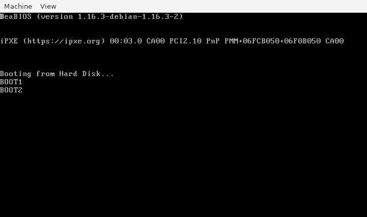

# atlas x86 Bootloader
A simple bootloader. Still in development. Just for educational purposes.


BUILD
=====
```bash
make
```

RUN
===
```bash
cd boot/x86
qemu-system-x86_64 -m 512M -hda hdd.img
```
It should look like the image below showing the stages and finally a B at the top.


